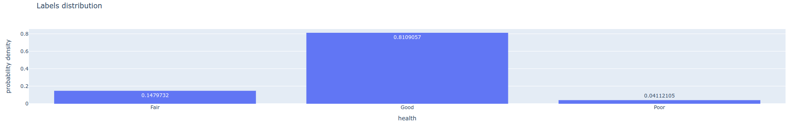
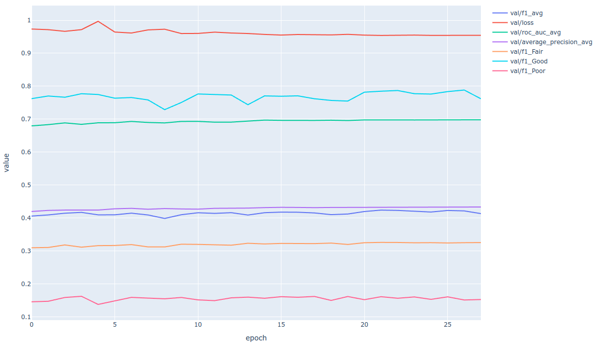
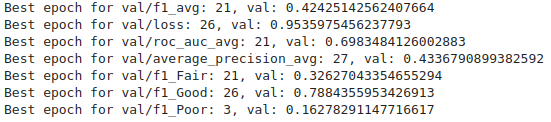
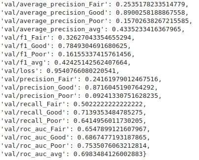
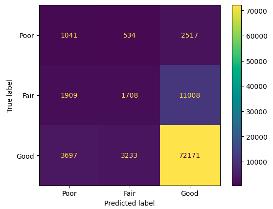

# Task MaxBitSolutions 

Бейзлайн решение для задачи мультиклассовой классификации состояния деревьев в парках.

## Install
1. Создание и активация окружения
```commandline
conda create --name mbs_trees python=3.7 && conda activate mbs_trees
```
2. Установка библиотек
```commandline
pip3 install -r requirements.txt
```
3. Установка торча 
    
   3.1 Для ГПУ версии (моя версия куды - 12.2)
    ```commandline 
    conda install pytorch==1.13.1 torchvision==0.14.1 torchaudio==0.13.1 pytorch-cuda=11.7 -c pytorch -c nvidia
    ```
   3.2 Или для ЦПУ версии
    ```commandline
    conda install pytorch==1.13.1 torchvision==0.14.1 torchaudio==0.13.1 cpuonly -c pytorch
    ```
4. Распаковка **resources.zip** и **EDA.zip**

   
## Technical details

* API - `api.py`
* train - `train.py`
* inference - `inference.py`
* **EDA.zip** следует распаковать в корне проекта.
* Архив **resources.zip** в корне проекта, необходимо распаковать. Гит не потянул по лимитам...


## Usage
### API
1. Запуск API
```commandline
python3 api.py
```
2. Request
```commandline
curl --location 'http://127.0.0.1:8000/get_predict'	\
 --header 'Content-Type: application/json' \
 --data \
'{ 
	"tree_dbh": 18,
	"curb_loc": "OnCurb",
	"user_type": "Volunteer",
	"borough": "Brooklyn",
	"sidewalk": "NoDamage",
	"guards": "None",
	"spc_latin": "Juglans nigra",
	"steward": "None", 
	"root_stone": "Yes", 
	"root_grate": "Yes", 
	"root_other": "Yes",
	"trunk_wire": "Yes", 
	"trnk_light": "Yes", 
	"trnk_other": "Yes",
	"brch_light": "Yes", 
	"brch_shoe": "Yes", 
	"brch_other": "Yes"
}'
```
3. Answer
```commandline
{
    "Poor":0.06998120993375778,
    "Fair":0.3612702786922455,
    "Good":0.5687484741210938
}
```

### Train
1. Примеры конфиг файлов находятся в `configs`. После редактирования конфиг файла, а так же `C` списка (он использовался как конвейер экспериментов) модель можно обучать
2. Обучение модели:
```commandline
python3 train.py
```

### Inference
Пример инференса найлучшей модели, на тестовой выборке:
```commandline
python3 inference.py
```
После инференса, таблица с лейблами и предсказанными вероятностями лейблов, сохранится по `save_test_table_path` или `resources/data/processed/test_inference.csv`
 по умолчанию


## Research
### EDA
_Вкладка EDA в EDA.ipynb._ Задача мультиклассовой классификации состояния дерева на данных NY 2015 Street Tree Census - Tree Data. **Важное замечание: в дальнейшем EDA был построен на той части данных, которая включала в себя значения таргета, обозначенные в тестовом задании (Poor, Fair, Good)** 

Данные собранны волантерами / сотрудниками парков, включают в себя признаки ухода за деревом, листвой, прилегающей территорией и пр. Для обучения модели были исключены некоторые признаки из-за возможности переобучения на них. Например 
были убраны id дерева, почтовый индекс, координата дерева, Основная информация:
* Класс health (таргет) включает в себя состояния **Poor, Fair, Good**, имеется дизбаланс классов. Poor'ов всего около 4% от всей выборки:


* Разделение и значения признаков:
```
__Информативные признаки:__
* tree_dbh - диаметр дерева (пней и мертвых деревьев в том числе) измеренный на определенной высоте 
* curb_loc - Флаг отдаленности дерева от бордюра (OnCurb - прямо возле бордюра, OffsetFromCurb - дальше от бордюра)
* spc_latin - Научное название вида дерева
* steward - Признаки "ухода" за деревом
* guards - Качество ограды дерева, не закрывает ли ограда доступ воды и пр
* sidewalk - Качество тратуара прилегающего к дереву
* user_type - Кем были собранны данные, персонал
* root_stone - Есть или нет проблема с корнями из-за брущатки 
* root_grate - Есть или нет проблема с корнями из-за ограды
* root_other - Есть или нет проблема с корнями из-за чего то еще
* trunk_wire - Проблема с основанием дерева из-за проводов
* trnk_light - Проблема с основанием дерева из-за освещения
* trnk_other - Проблема с основанием дерева из-за других причин
* brch_light - Проблемы с ветками из-за освещения
* brch_shoe - Проблемы с ветками из-за перекинутых кроссовок
* brch_other - Проблемы с ветками по другим причинам
* boroname - Имя района дерева
```

***
__Избыточные признаки (не включенные в бейзлайн)__
```
* problems - Проблемы перечисленные через запятую связанные с деревом
* status - Статус дерева (живое, мертвое, пень)
* stump_diam - диаметр пня
* spc_common - Обобщенное название вида дерева
* tree_id - айди дерева
* block_id - айди блока (области) дерева
* created_at - дата сбора аттрибутов семпла
* address - Ближайший адресс к дереву
* zipcode - Зипкод дерева
* zip_city - Зипкод города в котором расположено дерево
* cb_num - Код геолокации community board (?)
* borocode - Код района дерева
* cncldist - Код муниципального округа
* st_assem - Код округа сената штата
* st_senate - Код района сената штата
* nta - NTA код
* nta_name - NTA расшифровка кода
* boro_ct - ID переписного участка
* state - Штат в котором расположено дерево
* latitude - Координата дерева, широта
* longitude - Координата дерева, долгота
* x_sp - Координата X дерева в системе датасета "NAD_1983_StatePlane_New_York_Long_Island_FIPS_3104_Feet"
* y_sp - Координата Y дерева в системе датасета "NAD_1983_StatePlane_New_York_Long_Island_FIPS_3104_Feet"
* council district, census tract, bin, bbl - аттрибуты геопозиции дерева
```
Почему некоторые признаки были исключены, а некоторые нет? 
1. Геопозиционные признаки по типу "latitude", "longitude", "x_sp", "y_sp", "cncldist", "st_assem", "st_senate" и т.д.
Так как задачей было построение базового решения, то не понятно как отразится на модели добавление таких сложных признаков;
2. "tree_id", "block_id", "nta". На данных признаках модель может переобучиться, "запомнить" по id лейбл дерева;
3. Признаки дубликаты, обладающие единственным уникальным значением. "problems" (является обработанным дубликатом "root_grate", "brch_other" и др подобных признаков) или 
spc_latin и spc_common несут в себе одинаковую информацию. state и status обладали одним уникальным значением.


* Выводы по данным
1. Дизбаланс классов
2. Есть лишние признаки, которые в будущем могут помочь обогатить данные (см "**What can be improved? / Ideas**" абзац), например признаки геопозиции "x_sp" / "y_sp" или времени "created_at"
3. Для хороших деревьев характерен больший диаметр ствола (tree_dbh). Отдаленность от тратуара (curb_loc). Большая забота о посадке (steward) и уходе (guards). 
4. Наиболее частые причины плохого дерева - проблемы с корнями (root_grate == "Yes"), проблемы со стволом (trnk_other == "Yes"), иные проблемы с листвой (например плохие деревья обладают проблемой с листвой
brch_other == "Yes" чаще в 5 раз! чем здоровые "Good"/"Fair" деревья)
5. Деревья находящиеся в Манхэттене, в центре города, чаще хуже чем в других районах
6. В guards, sidewalk, spc_latin, "проблемноподобных" признаках имеются отсутствующие значения


### Preprocessing
_Вкладка Preprocessing в EDA.ipynb._
* Признаки были разделены на три основные категории:
    * Численные (tree_dbh)
    * Категориальные (user_type, guards, sidewalk, steward и пр)
    * Категориальные с большим количеством категорий (spc_latin)

Алгоритм обработки данных:
```commandline
1. Удаление тех примеров, в которых присутствуют отсутствующие значения в признаках:
    spc_latin, guards, sidewalk, problems
2. Стратифицированное разбиение на train/test/val, по health+spc_latin, чтобы в выборках 
    были одинаковые пропорции health и spc_latin
3. Нормализация tree_dbh (клип по "верхнему порогу" и np.log10)
4. OneHotEncod'инг категориальных признаков
```

* В дальнейшем категориальный с большим количеством категорий признак (spc_latin) будет подаваться на модель 
для получения эмбединга и дальнейшего использования этого эмбединга в модели

### Experiments

Ниже представлена таблица экспериментов

| Эксперимент | Random Seed | Model Name         | In Features | Complexity | Emb Dim | Emb Num | Batch Size | Num Epochs | Optimizer | Learning Rate | Scheduler           | Scheduler Params                     | Loss       | Loss Params                                  |
|-------------|-------------|--------------------|-------------|------------|---------|---------|------------|------------|-----------|---------------|---------------------|--------------------------------------|------------|----------------------------------------------|
| baseline_1  | 777         | BaseModel (simple) | 160         | 48         | -       | -       | 512        | 30         | Adam      | 0.1           | ReduceLROnPlateau   | mode=min, factor=0.33, patience=3    | bce_loss   | logits=True                                  |
| baseline_2  | 777         | BaseModel (hard)   | 160         | 48         | -       | -       | 512        | 30         | Adam      | 0.1           | ReduceLROnPlateau   | mode=min, factor=0.33, patience=3    | bce_loss   | logits=True                                  |
| baseline_3  | 777         | BaseModelEmb       | 28          | 48         | 16      | 132     | 512        | 30         | Adam      | 0.1           | ReduceLROnPlateau   | mode=min, factor=0.33, patience=3    | bce_loss   | logits=True                                  |
| baseline_4  | 777         | BaseModelEmb       | 28          | 256        | 16      | 132     | 512        | 30         | Adam      | 0.1           | ReduceLROnPlateau   | mode=min, factor=0.33, patience=3    | bce_loss   | logits=True, pos_weight=[24.31, 6.79, 1.23]  |

1. Модели (`modules/model/BaseModel.py`). BaseModel (simple) - 2-х слойная модель, BaseModel (hard) - 3х слойная модель. BaseModelEmb - модель с "эмбединг" слоем для категориального признака с большим кол-вом уникальных значений spc_latin
2. Для всех экспериментов зафиксирован сид
3. Использовал бинарную кросс энтропию в качестве лоса. А так же шедулер ReduceLROnPlateau для уменьшения lr
4. Веса pos_weight=[24.31, 6.79, 1.23] для исправления дизбаланса классов, получались как отношение количества каждого значения таргета к количеству семплов

### Result
Наилучшим экспериментом являлся baseline_4 (конфиг к нему в `configs/train_cfg_b4.yaml`). В отличии от Baseline_1/2/3 он не игнорирует класс "Poor". 
Обладает наилучшим средним f1_avg, precision для класса Poor

* **Кривые обучения по эпохам**

* **Лучшие значения метрик и их эпохи**

* **Значения метрик для финальной модели (модель отбиралась по f1_avg)**

* **Матрица ошибок для финальной модели**



## What can be improved? / Ideas
### Борьба с дизбалансом классов
1. Другие стратегии формирования весов
2. Active sampling / sampling weights во время обучения
3. Upsampling / downsampling
4. Увеличеный размер батча
5. Добавление из оставшихся данных (health = NaN) в класс Poor
### Обогащение данных
1. Геопозиционные признаки по типу "latitude", "longitude", "x_sp", "y_sp" можно использовать для получения данных о почве. 
Данных о качестве воздуха. Расстояние до ближайших элементов инфраструктуры города (канализация, заводы и пр)
2. "Времянной" признак типа created_at можно использовать для получения информации о времени года. Данных погодного профиля 
(например кол-во осадков за последние пол года, температура и пр)
3. Признаки scp_latin scp_common можно использовать для выделения видов деревьев в более общие группы
### Другие модели, подходы
1. TabNet, TabTransformer
2. Использовать softlabel (Fair класс пограничный случай с Good/Poor)
3. Перейти от задачи многоклассовой классификации, к задаче регрессии (Poor -> 0.0 - 0.33; Fair -> 0.33 - 0.66; ....). 
Чтобы как то меньше штрафовать модель за неверную классификацию


